# ER-диаграмма БД — ТОО «Первое кредитное товарищество»

> Согласовать до написания миграций. PostgreSQL 16 + PostGIS + TimescaleDB.

---

## Группировка по сервисам

| Сервис | Таблицы |
|--------|---------|
| core-api | users, borrowers, farms, loan_programs, notifications, tickets, ticket_messages, documents |
| expertise-svc | applications, application_history, collaterals, application_collaterals, expert_conclusions, committee_votes |
| sync-svc | loans, payment_schedule, loan_debts |
| geo (PostGIS) | districts, land_parcels |

---

## Mermaid ER-диаграмма

```mermaid
erDiagram

  %% ─── CORE-API ──────────────────────────────────────────────────────────────

  users {
    uuid        id              PK
    varchar     keycloak_id     UK "Keycloak sub"
    varchar     email           UK
    varchar     role            "public|borrower|employee|expert|admin"
    varchar     first_name
    varchar     last_name
    varchar     phone
    timestamptz created_at
    timestamptz updated_at
  }

  borrowers {
    uuid        id              PK
    uuid        user_id         FK
    varchar     inn             UK "ИИН физ. лица"
    varchar     bin                "БИН если юр. лицо"
    varchar     org_name           "Название хозяйства"
    varchar     activity_type   "crop_farming|livestock|mixed"
    uuid        farm_id         FK
    timestamptz created_at
  }

  farms {
    uuid        id              PK
    varchar     name
    varchar     district
    varchar     activity_type   "crop_farming|livestock|mixed"
    numeric     land_area_ha
    geometry    location        "PostGIS POINT (координаты)"
    timestamptz created_at
  }

  loan_programs {
    uuid        id              PK
    varchar     name
    varchar     name_kz
    varchar     name_en
    numeric     rate            "% годовых"
    numeric     min_amount
    numeric     max_amount
    int         min_term_months
    int         max_term_months
    text[]      activity_types  "crop_farming|livestock|mixed"
    boolean     is_active
    timestamptz created_at
    timestamptz updated_at
  }

  notifications {
    uuid        id              PK
    uuid        user_id         FK
    varchar     type            "payment|status|ticket|system"
    varchar     title
    text        body
    boolean     is_read
    timestamptz created_at
  }

  tickets {
    uuid        id              PK
    uuid        borrower_id     FK
    uuid        assignee_id     FK "employee"
    varchar     type            "early_repayment|restructuring|prolongation|other"
    varchar     subject
    varchar     status          "open|in_progress|resolved|closed"
    timestamptz created_at
    timestamptz updated_at
  }

  ticket_messages {
    uuid        id              PK
    uuid        ticket_id       FK
    uuid        author_id       FK "users"
    text        body
    varchar     attachment_path    "MinIO object key"
    timestamptz created_at
  }

  documents {
    uuid        id              PK
    uuid        owner_id           "borrower/application/collateral id"
    varchar     owner_type         "borrower|application|collateral"
    varchar     bucket             "MinIO bucket"
    varchar     object_key         "MinIO object key"
    varchar     name               "Имя файла"
    varchar     mime_type
    bigint      size_bytes
    timestamptz created_at
  }

  %% ─── EXPERTISE-SVC ─────────────────────────────────────────────────────────

  applications {
    uuid        id              PK
    uuid        borrower_id     FK
    uuid        program_id      FK
    uuid        assignee_id     FK "текущий исполнитель"
    varchar     status          "received|primary_scoring|security_check|collateral_expertise|legal_check|credit_analysis|credit_committee|approved|rejected|revision|documentation|issued"
    numeric     amount
    int         term_months
    varchar     payment_type    "annuity|differentiated"
    timestamptz created_at
    timestamptz updated_at
  }

  application_history {
    uuid        id              PK
    uuid        application_id  FK
    varchar     from_status
    varchar     to_status
    uuid        actor_id        FK "users"
    text        comment
    timestamptz created_at      "INSERT ONLY — никогда не UPDATE/DELETE"
  }

  collaterals {
    uuid        id              PK
    varchar     type            "land|equipment|livestock|real_estate|other"
    varchar     description
    numeric     estimated_value
    varchar     cadastral_number
    date        insurance_expiry
    date        last_inventory_date
    boolean     is_released     "высвобожден из залога"
    timestamptz created_at
    timestamptz updated_at
  }

  application_collaterals {
    uuid        application_id  FK
    uuid        collateral_id   FK
    timestamptz attached_at
    timestamptz released_at     "NULL если не высвобожден"
  }

  expert_conclusions {
    uuid        id              PK
    uuid        application_id  FK
    uuid        expert_id       FK "users"
    varchar     stage           "collateral_expertise|legal_check|credit_analysis"
    jsonb       risks           "чекбоксы рисков"
    text        conclusion_text
    varchar     result          "approved|rejected|revision"
    varchar     file_path       "MinIO — PDF заключения"
    timestamptz created_at
  }

  committee_votes {
    uuid        id              PK
    uuid        application_id  FK
    uuid        expert_id       FK "member of КК"
    varchar     vote            "approved|rejected|abstained"
    text        comment
    timestamptz signed_at
  }

  %% ─── SYNC-SVC (данные из 1С) ───────────────────────────────────────────────

  loans {
    uuid        id              PK
    varchar     one_c_id        UK "ID в 1С"
    uuid        borrower_id     FK
    uuid        program_id      FK
    numeric     amount
    numeric     rate
    int         term_months
    date        issued_at
    date        expires_at
    varchar     status          "active|overdue|closed"
    timestamptz synced_at       "TimescaleDB — время последней синхронизации"
  }

  payment_schedule {
    uuid        id              PK
    uuid        loan_id         FK
    date        due_date
    numeric     principal
    numeric     interest
    numeric     total
    boolean     is_paid
    date        paid_at
    timestamptz synced_at
  }

  loan_debts {
    uuid        id              PK
    uuid        loan_id         FK
    varchar     type            "principal|interest|penalty"
    numeric     amount
    int         days_overdue
    timestamptz synced_at
  }

  %% ─── GEO (PostGIS) ─────────────────────────────────────────────────────────

  districts {
    uuid        id              PK
    varchar     name
    varchar     name_kz
    geometry    geom            "PostGIS MULTIPOLYGON — контур района ЗКО"
  }

  land_parcels {
    uuid        id              PK
    uuid        farm_id         FK
    varchar     land_type       "cropland|pasture|fallow"
    numeric     area_ha
    varchar     cadastral_number UK
    geometry    geom            "PostGIS POLYGON — контур участка"
  }

  %% ─── СВЯЗИ ─────────────────────────────────────────────────────────────────

  users             ||--o| borrowers             : "1 user → 1 borrower"
  borrowers         ||--o| farms                 : "1 borrower → 1 farm"
  farms             ||--o{ land_parcels          : "1 farm → N parcels"
  users             ||--o{ notifications         : "1 user → N notifications"
  borrowers         ||--o{ tickets               : "1 borrower → N tickets"
  users             ||--o{ ticket_messages       : "author"
  tickets           ||--o{ ticket_messages       : "1 ticket → N messages"
  borrowers         ||--o{ applications          : "1 borrower → N applications"
  loan_programs     ||--o{ applications          : "1 program → N applications"
  applications      ||--o{ application_history   : "1 application → N history (INSERT ONLY)"
  applications      }o--o{ collaterals           : "application_collaterals"
  applications      ||--o{ expert_conclusions    : "1 application → N conclusions"
  applications      ||--o{ committee_votes       : "1 application → N votes"
  borrowers         ||--o{ loans                 : "1 borrower → N loans (из 1С)"
  loan_programs     ||--o{ loans                 : "1 program → N loans"
  loans             ||--o{ payment_schedule      : "1 loan → N payments"
  loans             ||--o{ loan_debts            : "1 loan → N debts"
```

---

## Индексы (критичные)

| Таблица | Поле | Тип | Причина |
|---------|------|-----|---------|
| users | keycloak_id | UNIQUE | JWT авторизация — каждый запрос |
| users | email | UNIQUE | логин |
| borrowers | inn | UNIQUE | идентификация заёмщика |
| applications | borrower_id | BTREE | фильтрация заявок по заёмщику |
| applications | status | BTREE | фильтрация очереди экспертизы |
| application_history | application_id | BTREE | аудит-лог |
| loans | one_c_id | UNIQUE | синхронизация 1С |
| loans | borrower_id | BTREE | ЛК заёмщика |
| payment_schedule | loan_id | BTREE | график платежей |
| payment_schedule | due_date | BRIN | TimescaleDB — временные запросы |
| farms | location | GIST | PostGIS — запросы по радиусу |
| land_parcels | geom | GIST | PostGIS — пересечения полигонов |
| districts | geom | GIST | PostGIS — определение района |

---

## Важные бизнес-правила в схеме

1. **application_history** — только INSERT, никогда UPDATE/DELETE (триггер на уровне БД)
2. **collaterals** — самостоятельная сущность: `is_released` + `released_at` в `application_collaterals`
3. **loans, payment_schedule, loan_debts** — только из 1С через sync-svc, не редактируются вручную
4. **documents** — polymorphic owner (owner_id + owner_type), файлы физически в MinIO
5. **farms.location** — PostGIS POINT, публичный слой карты
6. **land_parcels.geom** — PostGIS POLYGON, кадастровые данные
